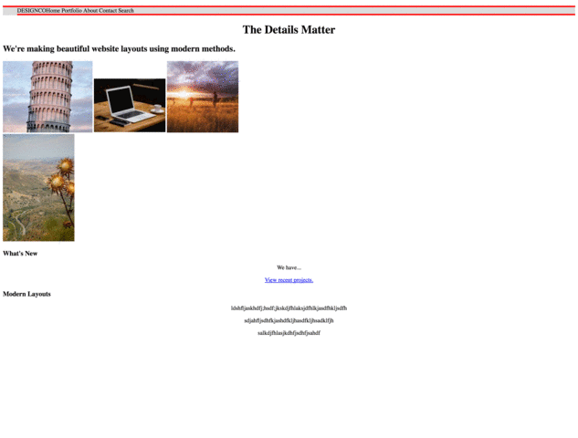
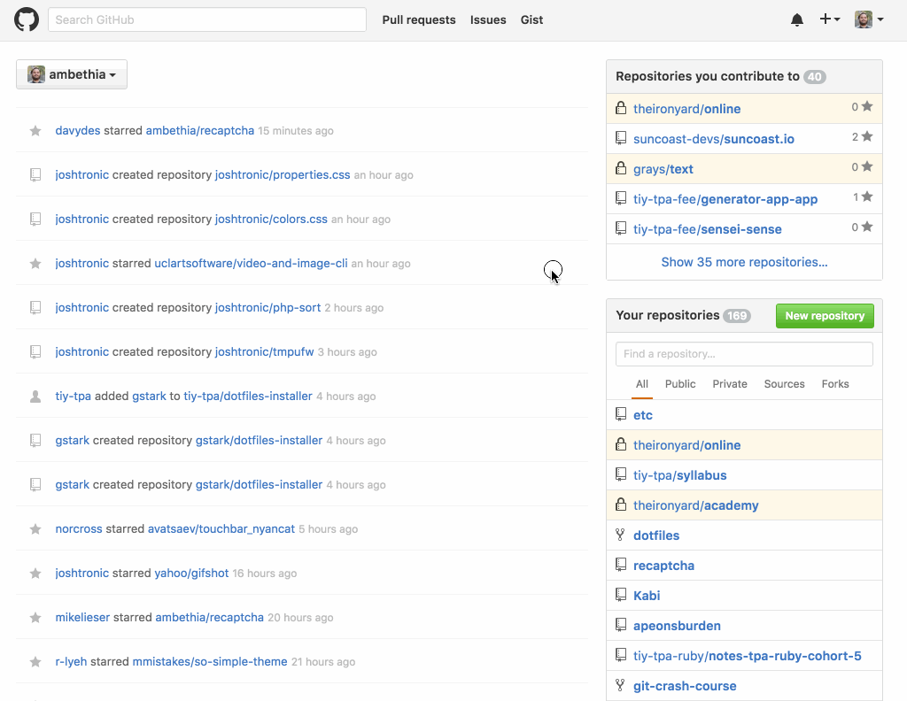
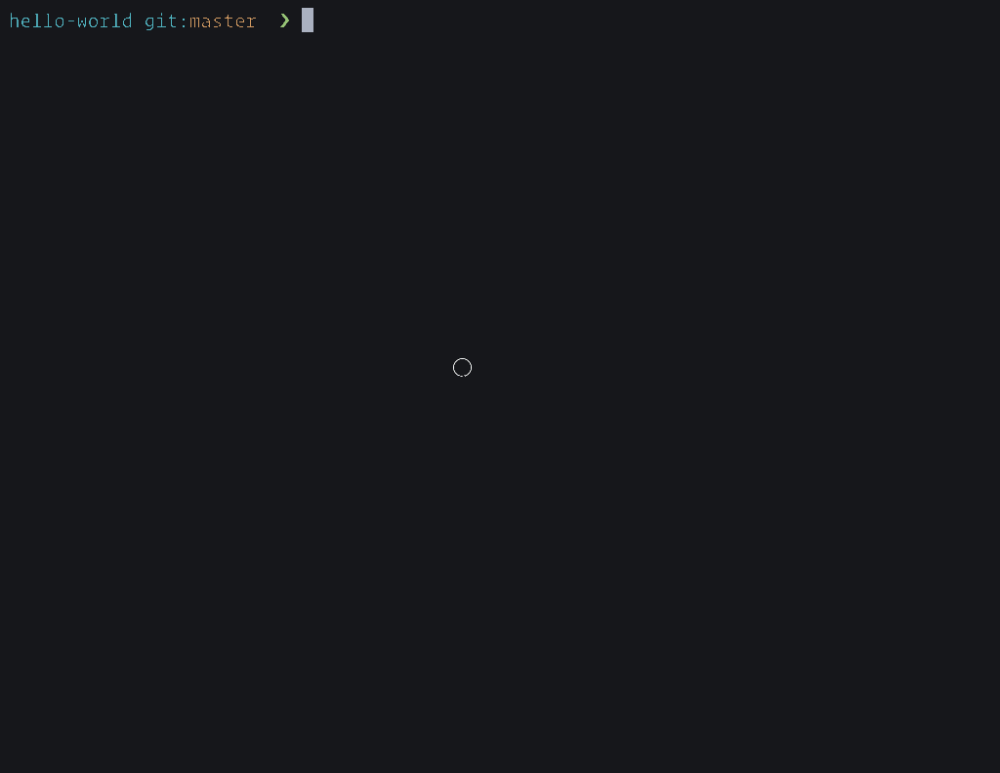

# DESIGNCO

Replicate the *DESIGNCO* design mockup below using HTML & CSS (Cascading Style Sheets).


## Objectives

- Build on your knowledge of HTML
- Get familiar with CSS
- Implement, from scratch, a given design

## Requirements

- The *DESIGNCO* logo has been supplied, along with a search icon. However the images for the gallery can come from [placeholder photos](https://unsplash.it) or pick our your own.
- You should strive to implement the design as close as possible, though, especially if you've never touch HTML or CSS before, this can be extraordinarily difficult, and will take a lot of practice and mileage. Here's some examples of past student's work on this _day two_ assignment:

  

- **Note**: You should complete at least the tasks given for _explorer_ mode as listed below before turning in the assignment, as well as before attempting _adventure_ or _epic_ modes.

[Download designco-assets.zip](https://tiy-learn-content.s3.amazonaws.com/11210a3e-designco-assets.zip)

### Setup

- First, ensure you have the [`app-app` generator](https://github.com/tiy-tpa-fee/generator-app-app) installed. We will have done this in class.

- Open your Terminal and create and change into the project's directory:

  ```sh
  mkdir -p ~/tiy/week-1/day-2/design-co
  cd ~/tiy/week-1/day-2/design-co
  ```

- Run the generator to create a boilerplate project:

  ```sh
  yo app-app alpha
  ```

  This might take a minute to run, the generator is installing a handy development server and a tool to easily deploy our page to the web.

- Let's create our `git` repository now, and start tracking changes right away:

  ```sh
  git init
  git add .
  git commit -m "Hello, App App"
  ```

  You can change the commit message to be anything you want.

- Open the project folder in Atom:

  ```sh
  atom .
  ```

  Remember `.` is an alias for the current directory.
- Tab back to your Terminal and start the development server:

  ```sh
  npm start
  ```

  This should automatically happen, but if it doesn't; navigate to [http://localhost:3000](http://localhost:3000) in your browser. As you make changes to your code, the development server will automatically refresh this page in real-time.

  While the development browser is running, it will control your Terminal, to exit it, press `Control-C`. You can always start it up again with `npm start`.

- Using the file browser in your editor, open the files `public/index.html` and `public/screen.css` and mark up and style your document (remember all content goes _inside_ the `<body>` tags). Don't worry about the other files in the directory for now, we'll talk about those later, right now, we're mostly concerned with the two files in `public`; `index.html` and `screen.css`.

### Explorer Mode

* Use a list of links to create a horizontal top navigation bar
* Use `flexbox` techniques to craft the image grid as well as the columns in the footer to divide the content areas
* Valid, neat, and organized HTML
* Valid, neat, and organized CSS

### Adventurer Mode

* Make the top navigation bar links highlight the background color from top to bottom when hovered
* Give the images to indication that you're hovering your cursor over them
* Combine the second, third, and fourth columns to use a single block of wrapping text. Making it thrice as wide as the first column. _hint:_ `flex-grow`

### Epic Mode

* Position the navigation bar to always be fixed on top of the screen
* Refine the layout so it works better on mobile phones using media queries
* Make the layout fluid using relative sizing so it can fit on a mobile phone

## Turning In

These steps will be followed for almost every assignment going forward. Once you've completed at least _explorer_ mode and you're satisfied with your work, let's get it published. First let's get it up on GitHub.

- First, let's add all our work to git, and ask it to commit it:

  ```sh
  git add .
  git commit -m "DESIGNCO"
  ```

  Feel free to replace _"DESIGNCO"_ with a more meaningful message.

- In your browser, go to [GitHub](http://github.com) and create a new repository, I suggest using the title of the assignment (`design-co`) for your repository name.

  

- Add the empty repository you created on GitHub as a _remote_ to your local repo:

  ```sh
  git remote add origin git@github.com:USERNAME/design-co.git
  ```

  Conveniently, you can copy this line from GitHub after creating a new repo.

- Push our local commits to GitHub:

  ```sh
  git push -u origin master
  ```

  The `-u` option tells git we want to making pushing the `master` branch to `origin` the default, so next time, we can just type `git push`.

- Now that our source code is up on GitHub, let's publish our page to [Surge](https://surge.sh). The command to do this has already been setup for you:

  ```sh
  npm run deploy
  ```

  This first time you do this, you'll be prompted to create an account. By default, surge will assign you a random subdomain name, we'll talk about customizing this another time. For now, set the "website" field of your GitHub repo's info to be that URL:
    

- Turn in the URL to your repository on GitHub in newline. It should look like:

  > `https://github.com/USERNAME/design-co`

## Additional Resources

- https://developer.mozilla.org/en-US/docs/Web/CSS
- http://flexboxin5.com
- http://flexboxfroggy.com
- https://css-tricks.com/snippets/css/a-guide-to-flexbox/
